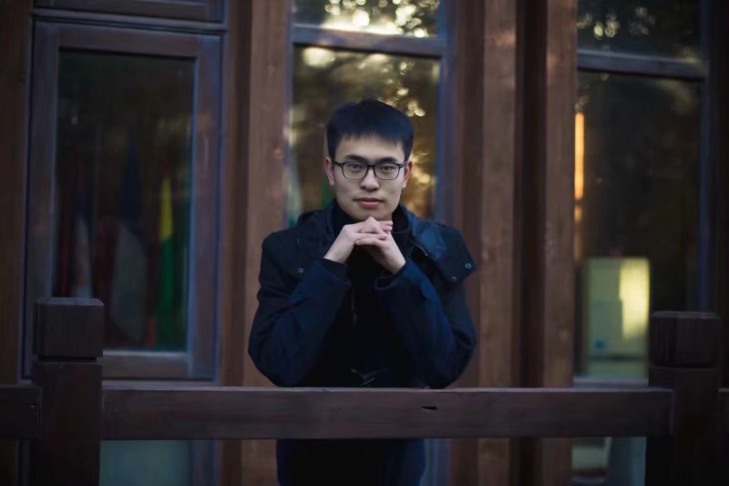

<table border="0">
  <tr>
    <td width="50%">
      <h1>Hao Lu (鲁昊)</h1>   
      
<b><a href="https://github.com/LuPaoPao">GitHub</a> <a href="http://miracle.ict.ac.cn/">Miracle</a></b>

      
<b>Mail: hao.lu@miracle.ict.ac.cn</b>

    </td>
    <td width="50%">
            
    </td>
  </tr>
</table>
# News

A paper was accepted by CVPR 2021.

A paper was accepted by VRIH.

A paper was accepted by CVPR 2020 workshop.

# EDUCATION
<h2>Education</h2>

<table class="imgtable"><tr><td>
 &nbsp;</td>
<td align="left">

 <strong>University of Chinese Academy of Sciences (UCAS)</strong> &nbsp; &nbsp; &nbsp; &nbsp; &nbsp;  &nbsp; &nbsp;  &nbsp; Sep. 2019 - Now  
Master in EE, GPA: 3.71/4.0  
Advisor: <a href="http://vipl.ict.ac.cn/view_people.php?url=hhan&id=39">Prof. Hu Han</a> and <a href="http://people.ucas.edu.cn/~skevinzhou">S. Kevin Zhou</a> 

</td></tr></table>
 

<table class="imgtable"><tr><td>
 &nbsp;</td>
<td align="left">

 <strong>ShanDong JianZhu University </strong> &nbsp; &nbsp; &nbsp; &nbsp; &nbsp; &nbsp; &nbsp; &nbsp; &nbsp; &nbsp; &nbsp; &nbsp; &nbsp; &nbsp; &nbsp; &nbsp; &nbsp; &nbsp; &nbsp; &nbsp; &nbsp; &nbsp; &nbsp; &nbsp; &nbsp; Aug. 2015 - Jun. 2019  
Bachelor in EE, GPA: 3.66/4.0  

</td></tr></table>

# PUBLICATIONS

Hao Lu, Hu Han. Dual-GAN: Joint BVP and Noise modelling for Remote Physiological Measurement. Proceedings of the IEEE/CVF Conference on Computer Vision and Pattern Recognition 2021.

Hao Lu, Hu Han. NAS-HR: Neural architecture search for heart rate estima-tion from face videos. Virtual Reality & Intelligent Hardware, 2021, 3(1): 33-42 DOI:10.1016/j.vrih.2020.10.002

XiaoBai Li, Hu Han, Hao Lu, et al. The 1st Challenge on Remote Physiological Signal Sensing (RePSS). Proceedings of the IEEE/CVF Conference on Computer Vision and Pattern Recognition Workshops. 2020: 314-315.

